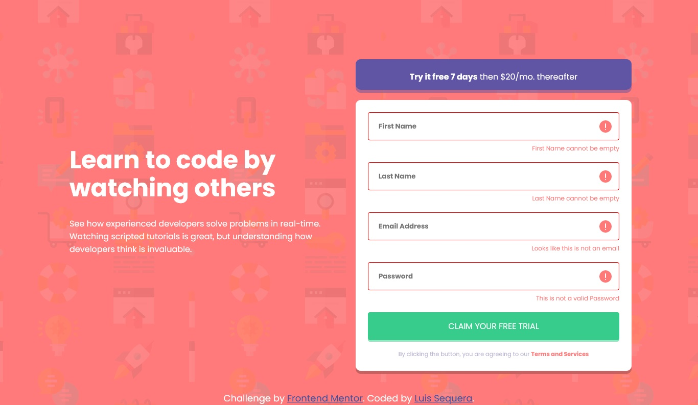

# Frontend Mentor - Intro component with sign up form solution

This is a solution to the [Intro component with sign up form challenge on Frontend Mentor](https://www.frontendmentor.io/challenges/intro-component-with-signup-form-5cf91bd49edda32581d28fd1). Frontend Mentor challenges help you improve your coding skills by building realistic projects. 

## Table of contents

- [Overview](#overview)
  - [The challenge](#the-challenge)
  - [Screenshot](#screenshot)
  - [Deploy](#links)
- [My process](#my-process)
  - [Built with](#built-with)
  - [What I learned](#what-i-learned)
- [Author](#author)

### The challenge

Users should be able to:

- View the optimal layout for the site depending on their device's screen size
- See hover states for all interactive elements on the page
- Receive an error message when the `form` is submitted if:
  - Any `input` field is empty. The message for this error should say *"[Field Name] cannot be empty"*
  - The email address is not formatted correctly (i.e. a correct email address should have this structure: `name@host.tld`). The message for this error should say *"Looks like this is not an email"*

### Screenshot

### Links

- Live Site URL: https://luissequeradev.github.io/validate-forms-html-css-js/

## My process

### Built with

- HTML5
- CSS custom properties
- Flexbox
- Mobile-first workflow

### What I learned

I learned about how to enter an email and password validation, and how to do the correct way to change the code so as not to break it.

## Author

- Website - [Luis Sequera](https://github.com/LuisSequeraDev)
- Frontend Mentor - [@yourusername](https://www.frontendmentor.io/profile/LuisUpc)
- LinkedIn - [luissequeradev](https://www.linkedin.com/in/luissequeradev/)
